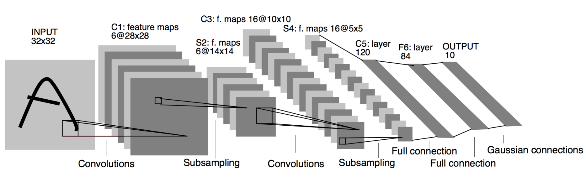

### **LeNet5** implement for image classification task on **MNIST** dataset by **PyTorch** 

###### This is "Hello World" program in CNN


### Requirement

Jupyter Notebook
PyTorch >= 0.4.0
torchvision >= 0.1.8


### Accuracy 

99%  just by a epoch 


### Usage

```
$git clone https://github.com/Janspiry/MNIST-PyTorch.git  
$cd MNIST-PyTorch  
```


### Detail

The network framework is like following picture，the only difference is that the picture size of MNIST is 28 * 28 rather than 32 * 32. 



Network use **CrossEntropyLoss** to calculate the loss and **Adam** to update parameters.


